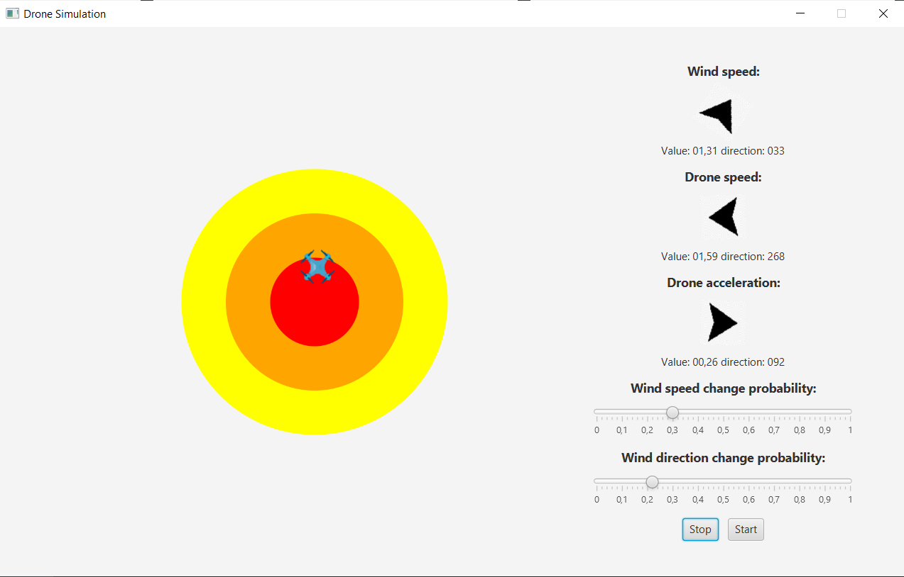

# Drone Fuzzy Controller

Simple simulation for present the force of fuzzy logic.

In the simulation fuzzy controller is programmed to keep drone in the centre of the map by controlling drone acceleration and counter wind.
Wind is the only thing that turns drone out of center and user can specified how much it changes.

The simulation gui as it follows:

There are a drone and 3 coloured circles on the left side. Circles help to judge how close to the centre is the drone.  

There are following elements on the right side:
- wind speed control that shows wind speed and direction
- drone speed control
- drone acceleration control - here output of the fuzzy controller is shows
- wind speed change probability slider
- wind direction change probability slider